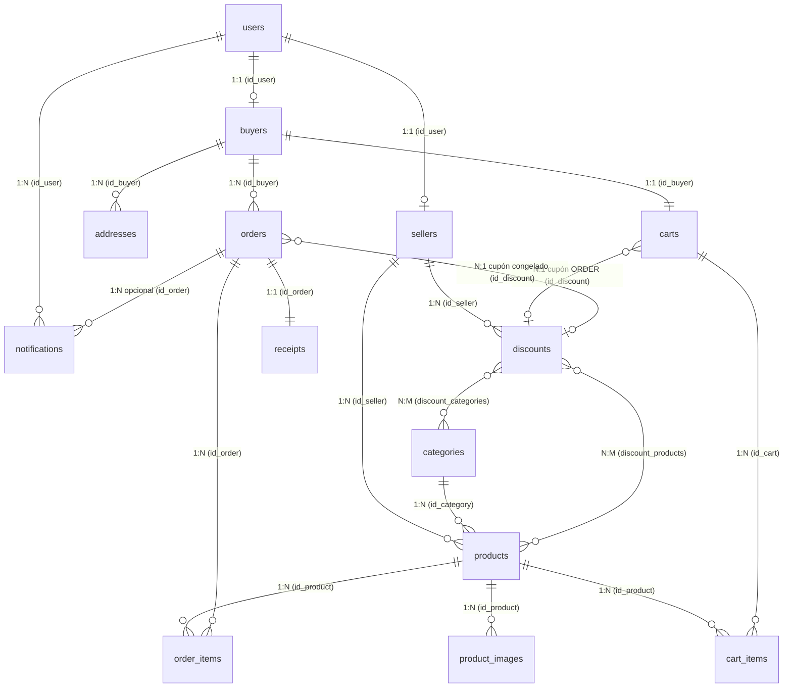

# Mermaid integration research

Date: 2026-10-01. **Experimental opt-in Merman CLI integration implemented; no permanent dependency selected.**

## Recommendation

The pinned Merman evaluation passed the reference graph's semantic checks. Initial isolated inspection found overlapping labels at 672 px; the user subsequently accepted its output in both mdview reader and split modes. Proceed with the authorized experimental CLI integration, not permanent dependency adoption. Keep official Mermaid as the compatibility-first alternative; evaluating its external runtime requires separate authorization. Do not write a home-grown parser or special-case this graph.

The earlier choice between “official JavaScript/browser” and “write our own native ER subset” was incomplete: existing native Mermaid-compatible projects provide a third path. They preserve automatic rendering without imposing Node/Chromium, but are young and do not guarantee complete Mermaid equivalence.

The initial source survey made no environment changes; the subsequent authorized build downloaded Merman, Cargo crates and an upstream-selected Rust toolchain, as recorded below. The user then authorized automatic-fence integration using that isolated executable. Defaults, dotfiles and permanent dependencies remain unchanged.

## Observed versus researched

- User evidence: the complex document worked well except that the Mermaid fence appeared as literal code. Their reference viewer rendered a graph. Accept that observation; the user scenario was not rerun.
- Original repository evidence: the code-block branch emitted `<pre><code>` without language dispatch. The new opt-in branch detects `mermaid` on the cmark AST before instrumentation, preserving exact literals and source ranges.
- Existing integration: `LOAD` converts the snapshot, lays out the whole document and collects source fragments; `DRAW` renders a bounded viewport. `lua/mdview/init.lua` coalesces source/width changes and rejects stale frames. Mermaid belongs to preparation/layout, not scroll redraw.
- Existing image support is a possible composition boundary, not a requirement for users to export images. Generated artifacts would remain automatic and session-owned; the Markdown buffer/file would stay unchanged.
- Native image decoding currently uses GdkPixbuf and caches full Cairo image surfaces (`third_party/litehtml/containers/cairo/render2png.cpp:94–128`). Bounded final frames do **not** automatically bound intermediate diagram surfaces.
- Local smoke actually executed: installed GdkPixbuf decoded an in-memory SVG containing a 24×16 rectangle, via `gdk_pixbuf_loader_new_with_type("svg")`, loader write/close and pixel inspection. Dimensions were 24×16; first RGBA pixel was `[18,52,86,255]`, matching `#123456`. This proves a simple SVG decoder is available here, **not** Mermaid SVG compatibility, foreignObject support or plugin integration.
- Local commands found `dot`, `node`, `cargo`, `rustc`, `rsvg-convert` and `nvim`; they did not find `mmdc`, `mmdr`, `merman` or a binary named `chromium` on PATH. This is not an exhaustive browser/package inventory.
- Observed versions: Rust 1.96.0, Node v26.9.0, Graphviz 16.1.0; libcmark-gfm 0.29.0.gfm.13, Cairo 1.18.4, Pango 1.58.2, GdkPixbuf 2.44.7, librsvg 2.62.3. `litehtml.pc` was unavailable; that does not contradict the project's `find_library` build contract.
- **Initial survey only:** no candidate had been built/rendered at that point. The subsequent evaluation below supersedes that runtime status. No Neovim/Kitty visual acceptance or regression-suite claim.

## Authorized pinned evaluation

User explicitly authorized downloading/building an isolated candidate, not adopting a dependency.

- Version: `v0.8.0-alpha.7`, commit `580e39b69cc1b0ca35c4f8272683e622b2e9b8db`.
- Release CLI profile: `--locked --no-default-features --features diagram-er,svg,png -j 2`. No ELK, Node, browser, network-icons or global Merman installation.
- Source, Cargo cache, binary and generated images/logs live under ignored `build/merman-evaluation/`; fixtures, evaluator and JSON evidence live in `tests/merman/`.
- Build side effect: upstream `rust-toolchain.toml` selected Rust 1.95.0; rustup downloaded six toolchain components into its normal storage despite preexisting Rust 1.96.0. They were not removed. The reproducible build script explicitly selects installed 1.96.0 to avoid another implicit toolchain download; that compiler variant has not been built here.
- Locked dependency hash, executable hash, actual model, compiled capabilities, environment and command-level timing/RSS are retained in [observed.json](tests/merman/observed.json). [first-sample.json](tests/merman/first-sample.json) preserves the earlier sample with implicit raster backgrounds.

### Observed behavior

The unchanged [reference input](tests/merman/reference.mmd) passed **14 named entities and all 20 relationships**, including exact quoted role text, accented characters, both endpoint cardinalities and identifying status. JSON relationships reference generated entity IDs; the evaluator resolves these through the entity table. Merman's `cardA` represents the right-hand symbol, `cardB` the left-hand symbol; the assertions explicitly account for this instead of interpreting descriptive `1:1` text as cardinality.

The [boundary input](tests/merman/boundary.mmd) passed all four cardinalities, identifying/non-identifying edges, attribute types/names/PK/comments, colons and Unicode roles. An exploratory boundary used an unquoted `many` entity name and was rejected (`unexpected zero or more; expected name`); the corrected general probe uses `Records`/`Entries`. Compatibility of reserved names with official Mermaid was not established.

PNG renders succeeded at 320/672 px in default/dark themes, with explicit white/`#0d1117` backgrounds. The reference was 320×286 / 672×600; the boundary 320×123 / 672×259. `--theme dark` alone did not change the CLI's white raster background, so background must be explicit.

**Visual inspection, not Kitty acceptance:** all reference entities are visible in the inspected 672 px PNG, but the `carts`→`discounts` and `orders`→`discounts` role labels overlap above `discounts`. Scaled text is small. The separate boundary PNG shows readable accents/attributes and differentiated circles/bars/crow's feet/dashed edges. These observations are sufficient to withhold the reference graph's visual acceptance, not to assert universal rendering failure. No graph-specific patch was attempted.

Both `resvg-safe` SVG artifacts decoded through the installed **GdkPixbuf path** without postprocessing: reference 1335×1189 RGBA and boundary 857×317 RGBA. Successful decoding is not pixel/geometry parity with the PNG exporter. Intrinsic decoding remains larger than the requested PNG width; it must not bypass intermediate-surface bounds in a future integration.

Malformed quoted input failed explicitly with `Unterminated string literal; missing '"'`, and published no PNG. A 16-byte source budget rejected the 1046-byte reference, with no SVG. A zero operation deadline failed without publication. A forced 64×64/4096-pixel raster budget yielded **64×57** with a constraint diagnostic (requested intrinsic 1336×1189). This observes constrained output; it is not an allocation trace or a hard bound on host font discovery.

### Timing scope

Final default/dark reference PNG at 672 px: **213.62 / 195.54 ms**, peak process RSS **27,752 / 27,748 KiB**. Three additional fresh-process default renders: **216.85 / 208.88 / 194.51 ms**, RSS **27,316 / 27,408 / 27,416 KiB**. SVG reference: **55.77 ms**, **22,396 KiB**. First sample differed substantially; no performance ranking or latency guarantee.

Each measurement includes process startup, parsing, layout, host font discovery, raster/export and write/close; no fsync, Neovim, Kitty or presentation. Repeats use warm filesystem caches, **not a persistent-worker warm render**. RSS is per-child `wait4` high-water RSS, including inherited process pages, not incremental renderer working set. No CPU affinity/load control or cold-cache experiment. This initial evaluation did not exercise editor integration; the later experimental integration checks below supersede that status. Persistent Merman process reuse and C ABI remain untested.

### Reproduce and inspect

```bash
bash scripts/build-mermaid           # explicit download/build only; no installation
python3 tests/merman/evaluate.py      # actual CLI semantic/render/resource probes
bash scripts/manual-merman replace   # inside Kitty: full-window mdview reader
bash scripts/manual-merman split     # inside Kitty: source left, mdview preview right
# Or inspect the generated reference outside Neovim:
bash scripts/manual-merman light
bash scripts/manual-merman dark
```

The earlier replace/split probes used normal Neovim configuration and the real mdview controller with already generated 672 px PNGs. The user accepted both modes. The current commands instead enable automatic fence rendering and use original reference/boundary source, or an optional document argument. No downloads, plugin defaults or dotfile changes; no-argument retains split mode.

A throwaway headless smoke exercised the actual launcher fixture in both modes, with native rendering and mocked image.nvim display/cell size: reader scrolled to y=907 (800×440 frame, 1352 colors), split to y=1093 (400×440, 216 colors); both closed with worker exit=0, session cleanup and unchanged source. Shell syntax passed. This is not real Kitty presentation or label-readability acceptance.

Run the two commands separately; optional second argument is your original Markdown document. In reader mode use `j`/`k`, `d`/`u`, `gg`/`G`; `e` enters source for edits, then `:MdViewOpen replace` reopens the reader. Split mode edits/scrolls the left source; close with `:MdViewClose`. Check initial rendering, unsaved label/entity edits, invalid syntax/recovery, resize, scroll and close/reopen. Exit with `:qall!` to discard probe edits. Automatic-fence Kitty acceptance remains separate from the accepted fixed-image probes.

Subsequent user feedback accepts automatic diagram presentation in reader and
split for their document, except the overlapping labels above `discounts`.
The mdview crop shows carts→discounts and orders→discounts roles colliding;
the supplied web-app crop shows collision in the same area, with wrapped text.
This overlap predates integration in standalone Merman output. The web app's
engine/version/configuration are unknown: its screenshot does not prove universal
official Mermaid behavior or that changing engines would resolve it.
The subsequent interactive checklist was user-reported passing in replace, and in
split except delayed scroll-follow. Supplied captures show the first graph while
the visible source has reached the second section, then an eventual jump.
A standalone Neovim TUI probe established that a concealed closing fence can remain
`winsaveview().topline` while the next heading is displayed. The new two-diagram
regression failed before correction and passed afterward: split skips zero-height
source lines via `nvim_win_text_height`, preserving whole-block Mermaid anchors.
A real-TUI native-renderer smoke with natural WinScrolled dispatch and mocked
image display observed logical topline 32, visible heading/frame line 33 and y=599;
the inspected 600×440 PNG starts with the second heading and diagram. Mermaid,
plugin, theme, cursor and CLI regressions passed. The user subsequently reported
improvement, but clarified that cursor line 37 should reveal the second diagram
while source topline is still 17; their next screenshot shows correct viewport
alignment at topline 36. They selected **keep active content visible**, not always
anchor the cursor at the top.

Implemented opt-in `split_follow="cursor"`; normal split defaults and replace remain
unchanged. DRAW accepts cursor byte position, an optional adjacent diagram source
line for heading reveal, and previous raster top. Native text/image extents and
whole-diagram bounds determine minimum scroll; a fitting diagram is fully visible,
with priority over its heading if both cannot fit. Oversized graphs retain their
start, not guessed relation positions. Cursor-mode viewports are not clipped to
the source bottom. Source CursorMoved/ CursorMovedI coalesce with existing one-DRAW
revision handling; stale cursor frames are rejected. No Mermaid regeneration on
cursor movement or height-only resize.

Real-TUI smoke with natural cursor events and mocked image display observed:
source top17/cursor17 → raster y71; source top17/cursor34 at second heading → y423;
cursor39 inside that graph → unchanged y423 (600×440). Inspected PNG contains the
entire second diagram, retaining some first-diagram tail because scrolling is
minimal, not centering. Two-diagram regression compares published pixels to an
independent ordinary-image viewport, checks unchanged source topline, minimum
scroll, stable in-diagram position, tall-graph return, height shrink/restore,
width reflow and latest ordinary-text cursor across a burst. Initial height-only
test also changed width through Neovim equalalways; the test now disables automatic
equalization to isolate height, then separately exercises width reflow.
Mermaid/plugin/theme/cursor/CLI regressions and native LSP diagnostics passed.
`scripts/manual-merman split` now enables cursor follow. Kitty visual acceptance
of this behavior remains pending; no default/dependency/dotfile change.

### Experimental integration contract

`setup({mermaid=true})` locates the bundled renderer automatically;
`setup({mermaid={renderer="/absolute/path/to/merman-cli"}})` selects a custom build.
Both extend LOAD only; omitted/false retains literal fences on initial setup.
The controller passes session artifact
directory and explicit palette background (otherwise stock `#0d1117`). Native
cmark detection preserves the buffer/file and invokes the executable without a
shell. Generated PNGs participate in normal litehtml layout; DRAW does not rerender
diagrams. Each source line maps to the entire block's y, not an entity/relation.
Unsaved edits, width/theme invalidation and coalescing use the existing revision
pipeline. Failed LOAD invalidates the old layout and deletes generated artifacts.
Linux process groups, parent-death signal and deadlines cancel pending work;
normal close/next LOAD removes diagram files.

PNG header validation before decode enforces width `max(1,viewport_width-64)`,
height 4096, 4 Mi pixels per image, 16 diagrams/16 Mi retained pixels per LOAD.
Each fence is limited to 1 MiB. Merman scheduling budgets alone are advisory:
the subprocess additionally has RLIMIT_AS 768 MiB for intermediate allocations,
CPU 6 seconds, file 24 MiB, wall 6 seconds, and a 15-second Mermaid LOAD deadline.
These are rejection limits, not low-memory measurements or an executable sandbox.
Only the diagram subprocess/raster is constrained; whole Markdown layout still
scales. Explicit theme background chooses dark/default by linear luminance; it
does not reproduce every adaptive palette foreground.

Independent native smoke rendered the unchanged 14-entity/20-relation fence at
900 px LOAD width: generated PNG 836×746, composed viewport 900×800, READY
231.344 ms and DRAW 39.212 ms (single run, no terminal latency claim). A second
DRAW at y=200 preserved the diagram hash. Invalid quoted syntax produced a
block-line diagnostic and removed the old image; correction recovered in the
same worker, QUIT exited 0 and removed the diagram directory. The composed
viewport was inspected; this is not new Kitty automatic-fence acceptance.

`nvim --headless -u NONE -l tests/mermaid.lua` passed with real Merman/native
rendering and mocked terminal image display: replace/split initial rendering,
unsaved graph pixels compared with an independent CLI + ordinary-image layout,
syntax failure/correction without stale display/files, in-flight latest-revision
convergence, actual window-width reflow, adaptive theme changes, block anchors,
scroll without rerender/image mutation, reopen cleanup and pending child-group
cancellation. Plugin/theme/cursor and CLI regressions also passed; C++ language
server diagnostics were clean. Lua language server was unavailable. Initial test
corrections: headless `columns` did not resize the real window; the split's deliberate
source-bottom clipping requires comparing the complete visible diagram region
against the full ordinary-image oracle, rather than unrelated following paragraphs.


## Options

| Approach | Compatibility evidence | Dependency/integration cost | Main risk | Recommendation |
| --- | --- | --- | --- | --- |
| Official Mermaid + diagram-only worker | Actual Mermaid implementation; ER documentation covers the supplied cardinalities and quoted Unicode labels | Node + Puppeteer + real headless browser; can reuse a browser process | Runtime footprint, sandbox/network policy, API/version coupling; layout still version-dependent | Best alternative when official compatibility outweighs the native-runtime constraint |
| Merman | Reference model passed 14 entities/20 relationships and boundary semantics; fixed-image modes user-accepted | Rust at build time; evaluated isolated CLI now optional at runtime | Alpha API, fonts, small labels and observed role-label overlap at 672 px | Experimental opt-in integration; permanent adoption undecided |
| mermaid-rs-renderer / mmdr | Native ER parsing and crow's-foot drawing | Rust source build or external native CLI; no documented ready-made C ABI in consulted surfaces | Simpler parser has quoting/error-handling limitations; reported label placement issues | Secondary candidate, not first compatibility choice |
| Own ER parser + Graphviz/Cairo | Only whatever subset we implement | Native C/C++ integration possible; we own translation/parser/layout adaptation | Permanent grammar and correctness maintenance; not broad Mermaid support | Only appropriate if we intentionally choose a documented ER-only product |

### Official engine

The inspected registry metadata reports Mermaid/CLI 12.0.0. CLI requires Node >=22.13.0 and Puppeteer ^25.0.0; Mermaid itself requires Node >=22.12.0. CLI source uses a real browser page and screenshots for PNG. Existing Chromium can be configured, but browser compatibility/sandbox prerequisites still need validation. Docker changes packaging, not the underlying browser dependency. [S1–S4]

A diagram-only backend would **not replace cmark/litehtml** or open a browser UI. `renderMermaid(browserOrBrowserContext, source, "png", options)` supports a caller-owned reusable browser. It still creates/closes a page per operation; reuse does not imply retained Mermaid/page state. The CLI explicitly says its Node API is not covered by semver. Pin the supported package/browser combination. [S1, S3]

[INFERENCE] Independent CLI launches repeat Node/browser startup. A persistent worker avoids that repeated process startup, but still pays parsing/layout/rasterization. No local timings support a millisecond or memory claim. Native projects' advertised speedup ratios against cold browser launches are not an editor comparison.

QuickJS alone is not a drop-in official backend: the inspected implementation also needs DOM/SVG/HTML measurement, fonts and browser rendering. A native SVG decoder consumes a completed diagram; it does not turn Mermaid source into one. Official output may contain HTML/foreignObject, so browser-produced PNG is the safer initial official composition boundary than assuming every SVG works in a native decoder. [S3, S5, S13]

`securityLevel="strict"` encodes HTML and disables clicks; it does not establish a no-network policy. CLI has local built-in assets but continues other requests and supports remote icon/font assets. A host must deliberately preserve offline operation and the browser sandbox, and constrain diagram resources. Do not adopt `--no-sandbox` snippets as defaults. [S3–S5]

Official compatibility does not mean matching the screenshot pixel-for-pixel: current v12 ER defaults use ELK/neo/redux-color, unlike older Dagre/classic/default output. Version, layout, theme and fonts must be explicit for a meaningful comparison. [S6]

### Merman

The evaluated release is **v0.8.0-alpha.7** (prerelease); its manifest requires Rust 1.95, edition 2024. The isolated CLI build succeeded with upstream-selected Rust 1.95.0. Use tagged documentation/header/library together: current-main and older release examples can differ. [S7–S10]

The ER grammar distinguishes exact-one, zero-or-one, one-or-more and zero-or-more cardinalities, identifying/non-identifying relationships and quoted roles. Source tests exercise Unicode and quoted-role semantics. Local runtime probes now establish the reference model's semantics and the boundary cases, but not acceptable reference label placement or universal glyph coverage. [S8]

`merman-ffi` already provides a C-compatible interface, static/shared outputs, native ABI 3, result ownership and cooperative operation control. A generic prebuilt C SDK is not supplied; source compilation is required. ABI 2 was removed, so this is not a stability guarantee. No direct Cairo drawing backend was established. SVG/native PNG can be composed into the existing preview; integration remains work. [S9]

Native PNG export uses resvg/usvg/tiny-skia. Raster documentation describes sizing and pixel/resource bounds; these controls must be checked on the pinned feature profile, not inferred from a library name. Its documented default text metrics and the final system fonts can differ; Pango host measurement is a possible integration point, not a validated solution. [S10]

Zed's merged PR #57644 independently demonstrates editor integration, **and exposes cost**: its author reports that Merman's SVG needs CSS/XML postprocessing and rasterizer compatibility fixes. That is evidence of adoption and integration risk, not proof our Cairo path is drop-in. [S11]

Own-code license: MIT OR Apache-2.0. Broad defaults can include EPL-2.0 ELK and font notices; a narrow ER/output feature profile may avoid optional components. Inspect the actual dependency/license closure before distribution. Both native candidates are young projects; Merman's alpha API/ABI changes are a maintenance consideration. [S7, S9]

### mmdr and writing our own

mmdr v0.3.1 is MIT and documents early development/output differences. Its inspected ER relation parser keeps the post-colon label as text without stripping delimiter quotes. [INFERENCE from parser/layout/render source] The supplied quoted labels may therefore retain literal quotes. Quote-aware entity parsing and malformed-input behavior also need scrutiny; upstream PR #156 reports an ER label hidden by a node. None of these behaviors were reproduced locally. [S12]

Its native SVG/PNG path is attractive, but the inspected PNG helper allocates at intrinsic SVG size; a host must impose bounds before allocation. “No browser dependencies” does not mean no Rust dependency graph, fonts or rasterizer. Do not select it from marketing speedups alone. [S12]

Graphviz's `dot` engine provides graph layout and native APIs, not Mermaid parsing. Its DOT grammar does not understand `erDiagram` or Mermaid cardinalities. A custom backend would still own lexing, quoted labels, semantic translation, crow's-foot markers, attributes, directions and explicit rejection of unsupported syntax. Reusing an existing Mermaid-compatible parser avoids much of that ownership. [S14]

## Integration requirements shared by either candidate

These are proposed acceptance requirements, **not implemented behavior**:

1. Extract `mermaid` fences from the existing cmark AST; pass their source unchanged to the selected engine. Do not run an unrelated regex Markdown converter over the whole document.
2. Generate diagrams automatically during preparation of an unsaved-buffer revision. Do not modify the source file or require manual export.
3. Retain artifacts across scroll frames; invalidate only when diagram source or rendering-affecting version/config/theme/fonts/size changes. A document edit outside the fence should not imply rebuilding an unchanged graph.
4. Publish diagram dimensions, document layout and source anchors for the same revision. Reuse existing coalescing/stale-result handling; never pair a new image with old layout.
5. Define source navigation honestly. Existing raster-image anchors map one source line to the image top. A rendered graph is spatial rather than line-ordered: exact per-relation source alignment cannot be claimed from that anchor. Block-range navigation needs an explicit contract; search/edit return must not silently use incorrect text-leaf geometry.
6. Bound intermediate graph raster size as well as final viewport size. Existing `img { max-width:100% }` constrains layout, not the size of a surface already decoded. Decide sizing from the document content area, not just terminal width; stock CSS has 720px maximum content width and horizontal padding.
7. Preserve raw/PNG transports, SSH/tmux fallback, palettes/layer independence and unchanged behavior for ordinary code fences. A requested backend missing or rejecting syntax needs a visible diagnostic; displaying code must not be described as successful diagram rendering.
8. Close frees session-owned assets/worker state. Offline resource policy, malformed/incomplete edits and graph resource limits are part of choosing a backend, not optional correctness details.

[INFERENCE] This keeps graph generation out of the scroll path, but composing/scaling the resulting image still has a cost. It does not promise unchanged scroll latency.

## Remaining decision gates

- Inspect the retained output in Kitty using `scripts/manual-merman`; do not rerun the user's original Markdown scenario to reconfirm their report.
- Current reference label overlap blocks adopting the tested Merman configuration. A separately authorized official diagram-only evaluation is the compatibility-first comparison, not a graph-specific patch.
- Before integrating any selected backend, measure persistent-worker warm rendering and exercise width/theme invalidation, overlapping unsaved edits and close cleanup. These are integration gates, not results of the standalone CLI probe.
- Final selection requires correct semantics, acceptable actual-width visuals and an explicit dependency/runtime decision. No large benchmark sweep is needed.

The exact Mermaid engine/version/config behind the supplied online screenshot is unknown. Use it as a semantic/visual reference, not a pixel-parity oracle.

## Reference input

The user's graph has 14 distinct entities and 20 relationship statements. The surrounding Markdown heading is ordinary Markdown; the following fence is the missing feature.



## Primary sources

Inspected documentation/source, not locally exercised candidate output. Moving documentation can describe newer behavior; pinned tags take precedence for an implementation.

- **S1:** [Official Mermaid CLI README/API caveat](https://github.com/mermaid-js/mermaid-cli#use-nodejs-api).
- **S2:** [CLI registry metadata](https://registry.npmjs.org/@mermaid-js/mermaid-cli/latest), [Mermaid registry metadata](https://registry.npmjs.org/mermaid/latest).
- **S3:** [Inspected CLI implementation](https://github.com/mermaid-js/mermaid-cli/blob/db1ceebbe529d7975474eb0d0e9c23e9dc57cd37/src/index.js), [asset/request interceptor](https://github.com/mermaid-js/mermaid-cli/blob/master/src/puppeteerIntercept.js).
- **S4:** [Puppeteer installation](https://pptr.dev/guides/installation), [sandbox/troubleshooting](https://pptr.dev/troubleshooting), [existing Chromium configuration](https://github.com/mermaid-js/mermaid-cli/blob/master/docs/already-installed-chromium.md).
- **S5:** [Mermaid usage/security/API](https://mermaid.js.org/config/usage.html).
- **S6:** [Official ER grammar and version-dependent defaults](https://mermaid.js.org/syntax/entityRelationshipDiagram.html).
- **S7:** [Merman README](https://github.com/Latias94/merman), [alpha.7 release](https://github.com/Latias94/merman/releases/tag/v0.8.0-alpha.7), [pinned manifest](https://github.com/Latias94/merman/blob/v0.8.0-alpha.7/Cargo.toml).
- **S8:** [Pinned ER grammar](https://github.com/Latias94/merman/blob/v0.8.0-alpha.7/crates/merman-core/src/diagrams/er_grammar.lalrpop), [ER alignment contract](https://github.com/Latias94/merman/blob/main/docs/alignment/ER_MINIMUM.md), [ER tests](https://github.com/Latias94/merman/blob/main/crates/merman-core/src/tests/er.rs).
- **S9:** [Pinned C/C++ interface, ABI and build contract](https://github.com/Latias94/merman/blob/v0.8.0-alpha.7/crates/merman-ffi/README.md).
- **S10:** [Raster sizing/resource policy](https://github.com/Latias94/merman/blob/main/docs/rendering/RASTER_OUTPUT.md), [native exporter](https://github.com/Latias94/merman/blob/main/crates/merman-export/README.md).
- **S11:** [Merged Zed Merman integration and SVG adaptation costs](https://github.com/zed-industries/zed/pull/57644), merged commit `63f725e8d6b2bb5ad1651523b689d54b45349574`.
- **S12:** [mmdr README](https://github.com/1jehuang/mermaid-rs-renderer), [v0.3.1 ER parser](https://github.com/1jehuang/mermaid-rs-renderer/blob/v0.3.1/src/parser.rs#L1484), [library/raster API](https://github.com/1jehuang/mermaid-rs-renderer/blob/master/src/lib.rs), [upstream ER label-placement PR](https://github.com/1jehuang/mermaid-rs-renderer/pull/156).
- **S13:** [librsvg feature limitations](https://gnome.pages.gitlab.gnome.org/librsvg/devel-docs/features.html), [referenced-file policy](https://gnome.pages.gitlab.gnome.org/librsvg/Rsvg-2.0/class.Handle.html#security-and-locations-of-referenced-files). The installed SVG loader smoke does not validate all features/security cases.
- **S14:** [Graphviz DOT language](https://graphviz.org/doc/info/lang.html), [dot layout](https://graphviz.org/docs/layouts/dot/), [native libraries](https://graphviz.org/docs/library/).
