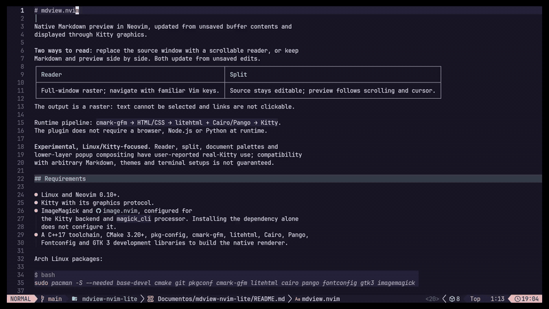

# mdview.nvim



Native Markdown preview in Neovim, updated from unsaved buffer contents and
displayed through Kitty graphics.

**Two ways to read:** replace the source window with a scrollable reader, or keep
Markdown and preview side by side. Both update from unsaved edits.

| Reader | Split |
| --- | --- |
| Full-window raster; navigate with familiar Vim keys. | Source stays editable; preview follows scrolling and cursor. |

The output is a raster: text cannot be selected and links are not clickable.

Runtime pipeline: `cmark-gfm → HTML/CSS → litehtml + Cairo/Pango → Kitty`.
The plugin does not require a browser, Node.js or Python at runtime.

**Experimental, Linux/Kitty-focused.** Reader, split, document palettes and
lower-layer popup compositing have user-reported real-Kitty use; compatibility
with arbitrary Markdown, themes and terminal setups is not guaranteed.

## Requirements

- Linux and Neovim 0.10+.
- Kitty with its graphics protocol.
- ImageMagick and [image.nvim](https://github.com/3rd/image.nvim), configured for
  the Kitty backend and `magick_cli` processor. Installing the dependency alone
  does not configure it.
- A C++17 toolchain, CMake 3.20+, pkg-config, cmark-gfm, litehtml, Cairo, Pango,
  Fontconfig and GTK 3 development libraries to build the native renderer.

Arch Linux packages:

```bash
sudo pacman -S --needed base-devel cmake git pkgconf cmark-gfm litehtml cairo pango fontconfig gtk3 imagemagick
```

## Installation

Clone and build explicitly:

```bash
git clone https://github.com/agmonetti/mdview.nvim.git
cd mdview.nvim
./scripts/build.sh
```

This builds `build/mdview-preview` for the plugin and `build/mdview-render` for
the standalone CLI. If absent, the script downloads the litehtml v0.10 Cairo
adapter into `third_party/litehtml/` and links against system litehtml; their
versions must be compatible. It does not install system packages. Opening a
preview never downloads dependencies or builds the renderer.

### lazy.nvim

Add the already-built checkout to your configuration:

```lua
return {
  {
    dir = "/absolute/path/to/mdview.nvim",
    name = "mdview.nvim",
    cmd = { "MdView", "MdViewOpen", "MdViewClose", "MdViewToggleDetail" },
    dependencies = { "3rd/image.nvim" },
    build = false, -- built explicitly above
    config = function()
      require("mdview").setup({})
    end,
  },
}
```

Replace `dir` with your clone's absolute path. Configure image.nvim separately
using its [setup instructions](https://github.com/3rd/image.nvim#setup).
This local-checkout recipe keeps native compilation explicit; `setup` is optional.

## Usage

Open a Markdown buffer, then:

| Command | Action |
| --- | --- |
| `:MdView` | Toggle the configured mode; default is the full-window reader. |
| `:MdViewOpen replace` | Open the reader in the source window. |
| `:MdViewOpen split` | Keep source on the left and preview on the right. |
| `:MdViewClose` | Close the preview and restore the source window. |
| `:MdViewToggleDetail` | In split, toggle the innermost details block under the source cursor. |

The preview reads unsaved buffer contents without writing the Markdown file.
Local images resolve relative to that file. Edits and width changes rebuild
layout; height-only changes redraw the viewport without relayout. One preview
session is supported at a time.

### Reader controls

| Keys | Action |
| --- | --- |
| `j` / `k`, arrows, mouse wheel | Scroll down/up. |
| `d` / `u`, `Ctrl-d` / `Ctrl-u` | Scroll half a page. |
| `Space` / `b`, `Ctrl-f` / `Ctrl-b` | Scroll a page down/up. |
| `gg` / `G` | Go to the beginning/end. |
| `]d` / `[d` | Select the next/previous HTML details header; selection is highlighted. |
| `za` | Toggle the selected details block; without a selection, report a no-op. |
| `e` / `Enter` | Return to the source near the current reading position. |
| `q` / `Esc` | Close the reader. |

After editing, use `:MdViewOpen replace` to reopen the reader. In split mode,
edit and navigate the source normally; the preview follows it.
With HTML enabled, sanitized `<details>` blocks open by default. Click a header
in either preview mode to fold/unfold it; clicking elsewhere does not toggle it.
The split command does not change Markdown buffer mappings. Fold state is
session-local and resets on close/reopen; unique unchanged blocks retain state
across edits, width changes and palette reloads. Collapsed source lines navigate
to their header. The raster does not provide clickable links.

## Configuration

Combine options in one `require("mdview").setup({...})` call. All options below
are optional; this example changes the selected behavior, not global defaults:

```lua
require("mdview").setup({
  mode = "split",           -- default: "replace"
  split_follow = "cursor",  -- default: "viewport"
  theme = "nvim",           -- optional: "dark", "light", "nvim"
  preset = "fluid",         -- optional: raw + reader smoothing
  zbelow = true,            -- optional: allow popups to cover the raster
})
```

- **Split follow:** `viewport` follows the first displayed source line; `cursor`
  minimally scrolls to keep active content visible. A Mermaid diagram maps to its
  whole block, not individual entities or relations. Cursor-follow Kitty visual
  acceptance remains pending.
- **Themes:** omitting `theme` preserves stock or custom CSS. `dark` and `light`
  select document palettes; `nvim` derives colors from Neovim highlights and
  refreshes on colorscheme/background changes.
- **Fluid:** `preset="fluid"` enables local raw RGBA transport and reader smoothing
  with factor 0.6 and an 84 px clamp. It does not enable layers or promise a frame
  rate. Explicit setup fields override preset values.
- **Layers:** `zbelow=true` requests local raw transport and a lower placement so
  popup backgrounds can cover the document. Failed terminal background/opacity
  detection retains normal placement with a warning.

Raw falls back to PNG/image.nvim under SSH, tmux or missing Kitty identification.
This does not make unsupported terminals compatible; PNG still needs a working
image backend. Requested smoothing remains enabled on fallback, without the raw
performance assumptions. Reader cursor hiding requires `termguicolors`.

See the [configuration guide](docs/configuration.md) for all setup options,
custom stylesheets, fallbacks and advanced environment controls.

## GitHub alerts (optional)

Enable native `NOTE`, `TIP`, `IMPORTANT`, `WARNING` and `CAUTION` alerts:

```lua
require("mdview").setup({ alerts = true })
```

```markdown
> [!WARNING]
> Keep a backup before overwriting existing data.
```

Each alert has a title, a bundled GitHub Octicon and a colored left border, with
dark, light and Neovim palette support. Unsaved edits update both reader and split;
source navigation retains individual body-line anchors. Icons require the
GdkPixbuf SVG loader (usually supplied by librsvg); no browser, font or download
is needed at runtime. Rebuild the native renderer after updating this checkout.

Omitted or `false` keeps ordinary quotes with literal markers. Only uppercase
markers alone on the first line of a standalone quote are recognized; escaped,
unknown, code and nested markers stay ordinary Markdown. Custom alert titles and
collapsible admonitions are not supported. See [alert configuration](docs/configuration.md#github-alerts).

## Closed HTML subset

Raw HTML is enabled by default, but only these structures are sanitized and
rendered:

| Content | Supported markup | Notes |
| --- | --- | --- |
| Inline formatting | `br`, `kbd`, `sup`, `sub`, `span`, `strong`, `u` | `span` is unwrapped; other attributes are discarded. |
| Blocks | `p`, `div`, standalone `h1`–`h6` | `align="center"` is honored on headings and paragraphs only. |
| Images | Local `` | Relative to the Markdown file; optional `width` and `height`. Remote URLs are not fetched. |
| Tables | `table`, `caption`, `thead`/`tbody`/`tfoot`, `tr`, `th`/`td` | Only `colspan` and `rowspan` are honored; values are 1–64. |
| Disclosure | `<details>` with a nonempty first `<summary>` | Summary permits `<b>` or one direct heading containing text, entities and `<b>`. |

Nested or multiple summary headings, `<strong>` and `<p>` inside `<summary>` are
not supported; those fragments stay literal.

Image dimensions are positive integer pixels, optionally suffixed `px`. One
dimension preserves aspect ratio; two specify a containment box. Invalid
dimensions, unsupported markup and invalid nesting remain visible as escaped
source, with a diagnostic where applicable; they do not discard the rest of the
document. Complete comments are ignored. SVG, HTML links and arbitrary HTML are
not supported.

```html
<p align="center"><strong>Release notes</strong></p>

```

For details content, leave a blank line after `</summary>` before Markdown
headings or lists; otherwise cmark may treat them as literal text. To reject raw
HTML instead of applying this subset, use
`require("mdview").setup({ html = false })`. Markdown images retain their
existing loader and format behavior.

Local Kitty probes: `bash scripts/manual-dimensions split|replace` for image
sizing; `bash scripts/manual-tables split|replace` for tables. Exit the first
Neovim session before starting the second mode.

See the [HTML policy and image limits](docs/configuration.md#closed-html-subset)
and [development evidence](docs/development.md#closed-html-subset).

## Interactive details

Sanitized `<details>` and `<summary>` blocks are supported by default when HTML is enabled.
They open by default and can be toggled interactively in both reader and split modes:

- **Mouse:** Click anywhere on a visible details header in the preview pane to fold or unfold it.
- **Reader keys:** `]d` / `[d` select the next or previous details header with a visible raster highlight; `za` toggles the selected block.
- **Split command:** `:MdViewToggleDetail` toggles the innermost details block containing the source cursor. No mappings are installed in the source buffer.

Fold state is session-local and does not modify the source file. Unchanged blocks preserve their state across edits, width changes, and palette reloads. See [interactive details configuration](docs/configuration.md#interactive-details).


## Mermaid diagrams (optional)

Mermaid fences remain literal code blocks unless explicitly enabled. The optional
Merman CLI integration renders unsaved changes automatically. The evaluated build
supports **ER diagrams**, not complete Mermaid compatibility; unsupported diagram
families (such as `flowchart LR`) remain literal code blocks while the rest of the
document renders. Relationship labels in rendered ER diagrams can overlap.

1. From the checkout, explicitly build the pinned optional renderer:

   ```bash
   ./scripts/build-mermaid
   ```

   Requires Rust/Cargo 1.96.0 and network access. This downloads Merman source and
   Cargo dependencies into `build/merman-evaluation/`, without a global Merman
   installation. Rustup may download the toolchain if missing.

2. Add `mermaid = true` to your existing setup call:

   ```lua
   require("mdview").setup({
     mermaid = true,
   })
   ```

The plugin finds the bundled renderer automatically; no executable path is needed.
Opening a preview never downloads or builds it. If the renderer is missing, the
preview reports the build command. A custom executable path is an
[advanced option](docs/configuration.md#mermaid).

Restart Neovim after building/configuring. Malformed supported diagrams and other
render failures identify the opening source line and recover after correction;
unsupported diagram families instead stay literal. Large graphs may exceed resource
limits.
See [Mermaid configuration](docs/configuration.md#mermaid) and the
[evaluation and integration report](docs/mermaid-research.md) for limits and compatibility.

## Limitations

- Arbitrary HTML is not supported. Unsupported or malformed fragments render as
  escaped text; `html=false` instead rejects raw HTML with a preview error.
  Source attribution may still fail explicitly for untested Markdown combinations.
- No math rendering, code syntax highlighting, interactive links or text selection.
- CSS support is limited by litehtml; browser/VS Code fidelity is not guaranteed.
- Local image formats depend on GdkPixbuf; remote images are not fetched.
- Plugin raster frames are viewport-bounded, but whole-document layout memory and
  edit/width-change cost grow with input size. Intermediate image allocations are
  not generally bounded by the viewport.
- Exact source alignment with all conceal, virtual text and wrapped-row combinations
  is not guaranteed. Cursor-follow diagrams too tall for the pane show their start.
- Only one session is supported. image.nvim and ImageMagick are current plugin
  requirements, including when raw transport is requested.

## Standalone CLI

From the built checkout, render the demo outside Neovim:

```bash
./scripts/md2png examples/demo.md /tmp/mdview-demo.png 900
kitten icat /tmp/mdview-demo.png
```

Run `kitten icat` inside Kitty. To inspect HTML conversion only:

```bash
./scripts/md2png --html-only examples/demo.md /tmp/mdview-demo.html
```

This CLI needs neither image.nvim nor ImageMagick, but creates temporary HTML
beside the Markdown file (write access required) and removes it afterward. Unlike
the plugin, its PNG covers the full document and may consume excessive memory or
fail for long files.

## Documentation and development

- [Configuration](docs/configuration.md): options, themes, layers and fallbacks.
- [Development and verification](docs/development.md): tests, manual Kitty checks
  and reproducible scroll benchmarks. Synthetic callbacks and Kitty load ACKs do
  not measure physical touchpad input or screen presentation.
- [Performance and historical evidence](REPORT.md): retained results, decisions,
  measurement limitations and earlier prototypes.
- [Mermaid evaluation and integration](docs/mermaid-research.md): compatibility,
  visual limitations and retained evidence.

Core dependencies: [cmark-gfm](https://github.com/github/cmark-gfm),
[litehtml v0.10 Cairo adapter](https://github.com/litehtml/litehtml/tree/v0.10/containers/cairo),
[Cairo](https://www.cairographics.org/), [Pango](https://www.pango.org/),
[image.nvim](https://github.com/3rd/image.nvim) and the
[Kitty graphics protocol](https://sw.kovidgoyal.net/kitty/graphics-protocol/).
